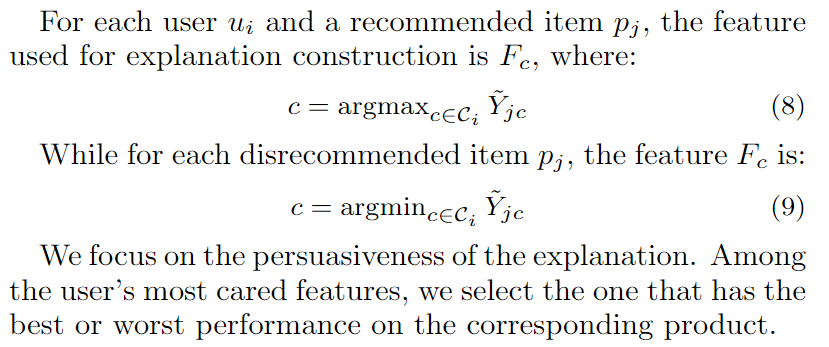

# Explainable Recommendation A Survey and New Perspectives

## 1. Introduction

### - Historical Overview

RS早期方法主要集中在CF和Content-based methods。
CF：推荐user的item主要是与user之前交互过的item set里相似的item。CF的核心思想为为user推荐和他相似的users交互的物品。也就是群体智慧来预测缺失的评分。但CF的解释性不如Content-based。CF与LFM(latent factor model)结合时，**MF**效果甚佳。但是！MF核心思路为降维，这很难解释。为了理解模型，提出了EFM(Explicit Factor Model),使得latent dimension与explicit feature对齐进行解释。

Content-based：基于各种attribute 推荐、价格，颜色，品牌；导演，类型，时长。因为Content-based RS 很容易被理解，可以通过content提供**Explaination**

### - Classification

2个正交维度进行分类：

    1. HCI角度: The information source or display style of the explanations(文本句子或视觉解释)
    2. 算法角度: The model to generate explainations(KNN, MF, topic modeling, DL, GNN, KG, association rule mining...)
这是一个survey中的一个分类图

### - Explainability and Interpretability

XAI目的时开发让用户理解的模型的决策。为了实现目标，模型可以是 interpretable or non-interpretable。 Interpretable model 致力于局部或者全局透明的模型(transparent)，类似于决策树模型，线性模型，path-depend。这些都是易于向用户说明推荐的原因。**但是**，interpretability并不是实现EX的唯一办法。可以用过一些技术去揭示模型内部决策机制。e.g., attention mechanism, NLP技术, post-hoc解释模型(事后解释)。

## 2. Information Source/Display Style(HCI perspective)

这个标题意味着，向用户展示一条信息，告诉用户为什么推荐特定项目。有着很多的不同风格的解释，如图所示是各种不同风格的解释。

### - User/Item-based Explanation

提到用户或者物品-based就会想到CF，user-based or item-based explanations 通常利用implict/explicit feedback 来解释推荐。首先为用户找到相似用户(邻居)，然后邻居们对推荐的item有着积极的评分 -> 推荐。可以使用图表的形式向目标用户展示，进行解释。如图所示，

邻居觉得它很好，所以推荐了。Item-based就会告诉用户，推荐的item和之前user喜欢的item有一些相似。

previous research说提供解释有诸多好处：**transparency(透明性)，scrutability(可审查性),可信性，有效性，persuasiveness(说服性)，效率，满意度**

User-bansed EX 和 Item-based EX比较， Item EX更易于理解，因为用户了解他之前交互的内容，但用户对别的相似用户可能并不知道，所以说服力有所下降。解决办法：不是基于相似用户，而是基于社交联系。是的用户信任感增加，并且解释会变得更易于接受。

### - Feature-based Explanation

类似于content-based，feature-baseed就是基于内容做出解释，像电影的导演，类型，演员等。如图为对目标用户推荐的解释，推荐的电影的各个属性，系统觉得用户会感兴趣。

当然解释风格不局限于此，还有雷达图(5角星)来展示解释。
Feature还包括了user profile,like 人口统计特征 年龄性别居住地...

### - Opinion-based Explanation

被分为：aspect-level and sentence-level方法(方面级，句子级)。
aspect-level：展示item aspect(color, quality)和对应分数做为解释。
sentence-level：展示解释的句子。

aspect-level 解释类似于Feature-based，不同处为：一般aspect在item或者user profile中不可以直接使用，而是需要从item review去学习对应观点和情绪。类似于从review中抽出“方面-意见-情感”的三元组，"噪音-高-负面"，“屏幕-清晰-正面”。
这些三元组可以通过词云的形式去解释。

### - Sentence Explanation

sentence-level就是为用户提供解释的句子，被分为2种：template-based and generation-based 方法。
基于模板的就是把feature填到准备好的句子里.

也有研究使用regression tree来进行选择解释的语句。

generation-based模型：不使用模板而是直接生成解释语句。我们可以使用LSTM生成解释，还可以结合crowdsourcing/GRU门电路去生成解释。这种模型极度依赖review，但需要注意的是review里有很多噪音。

### - Visual Explanation

利用图像直觉进行解释，就像图2.1，系统觉得user会喜欢这个lens是因为他的领口外观，所以就圈出来了。(我觉得这个太抽象了)
这个小领域只能说，**未来可期**。

### - Social Explanation

受到"相似用户"这个想法的激发，使用社交关系可以使得用户更加信任系统。像Facebook在推荐新朋友的时候，会和你说共同好友。并且在推荐item中，可以向用户展示她有多少个朋友喜欢该物品。

有研究发现，解释会影响user的选择，也就是说更多的朋友在关注的内容，该user也有更大的概率去浏览。**但是**，这个概率却和内容本身的质量无关，就像电影，音乐家这种。

**社交解释和相似用户的解释可以结合使用**

上述为6种解释风格，通常会和下面所讲的推荐算法一起使用。

## 3. Explainable Recommendation Models(Algorithm perspective)

这部分的内容主要介绍如何考虑推荐方法和推荐结果的可解释性。一般的做法为：提高模型**透明度**，这类做法的代表是：Factorization-based, Topic Modeling, Graph-based, Deep Learning, Knowledge-based, rule mining 方法。

另一种做法为：只关注**推荐结果**的可解释性。思想：model看成一个黑盒，并为此开发一个单独的模型用来解释推荐结果。这类做法的代表：post-hoc/model-agnostic方法（事后/模型不可知 模型）

### - Factorization Models for Explainable Recommendation

MF/tensor-factorization 在解释性上问题是user/item embedding是潜在的。在MF中，我们假设user embedding 和 item embedding在低维空间中，每个维度都表示影响user决策的特定因素，但是，传统MF中，无法确定每个因素的确切含义。使得难以解释。

为了解决这个问题：EFM(Explicit Factor Models)，基本思想为推荐用户最喜欢的feature上表现好的item。如图，从review提取item feature然后对齐每个MF的latent dimension和explicit feature，这样就可以获得预测过程来给出解释。

Step1: 从review中进行情感分析，或者一个三元组(Feature, Opinion, Sentiment),(battery, life, -1).

Step2: 把这些特征词作为 Explicit Feature Space，用户对不同特征的关注度和item各个特征的质量被整合到model里。

**EMF细节**：如何将feature加入到MF中。

**ONE**：阴影块代表user对item的评论，包括了rating和review text。使用NLP技术识别review中是否含有情感以及积极或消极。再生成(特征，情感分数)的pair。通过这步，我们得到了Feature-Opinion pair。

**TWO**：这篇论文假设用户更倾向于评论他们关心的feature。所以去构建一个matrix X代表user-feature attention。考虑 useri 的所有评论，提取所有(Feature, Sentiment)pair。Feature Fj 被 useri 提及 tij次，则在attention matrix X中的表示如下：

就是用sigmoid函数将这个提及频次tij归N化，N为该数据集的理论最大评分，类似于yelp为5分。目的为是的X矩阵和user-item rating matrix A的规格一致。

**Three**：类似于**TWO**，同样构造一个item-feature的质量矩阵 quality matrix来表示item在各个feature上的程度/质量。类似于X矩阵的求法，对于一个物品pi,会使用所有对应的评论去提取假设(Feature, Sentiment)pair，Feature Fj 在 item pi上被提及 k次，平均情感为sij。Y矩阵如下可求得：

这样同时考虑了 流行度 和情感。

**Four**：整合Explicit 和 Implicit Feature,类似于MF分解user-item rating matrix 成2个低维向量，同样在user-feature attention matrix X 和 item-feature quality matrix Y上构造 Factorization model，去估计 latent embedding of users, items, features.可以通过最小化latent embedding的内积与X Y矩阵的差距来实现：

这里 &lambda; 是正则化系数，r是分解得到的**explicit factor**的数量。V代表了特征的向量表达形式(pxr)

user对各个item的评分基于他对item的各个方面综合评价得出，所以这篇论文用U1和U2分别表示用户对特征的关注，和物品在对应特征上的表现。然而，这些explicit feature不能完全解释用户的评分，所以这篇文章同样引入了implicit feature ( r' 个latent feature),也就是H1和H2, P Q分别为 U和H的串联，P代表了用户侧，Q代表了物品侧。通过最小化PQ内积与评分矩阵A来获得H：

hidden factors 的估计估计方法如下：

**注意**：当r = 0时，这就是一个 传统的LFM(latent factorization model)。

整合的Implicit Feature 和 Explicit Feature的示意图如下：我们先得到X Y，然后去做分解得到U V,再引入H，最后计算得到A。

通过上述操作，我们可以得到补全后的X', Y', A'矩阵:

- X' = U1 VT
- Y' = U2 VT
- A' = U1 U2T + H1 H2T

Top-k推荐：

Explanation：template-based

选取feature的方法为：

实验部分也比较有趣，关于各个feature数量(r, r')和最care的数量(k)的实验。

paper: [*Explicit factor models for explainable recommendation based on phrase-level sentiment analysis*](https://dl.acm.org/doi/10.1145/2600428.2609579)

随后，由于用户的偏好时随时间变化的，所以作者拓展了这个paper，根据每天行动去建模最喜欢的feature。

再之后，有研究者扩展了EFM到 **tensor factorization**,从review中提取item feature，进而构建uer-item-featrue cube。另一个研究通过tensor 的多任务学习，进一步推广MF的可解释性。简单说，2个伴随任务：“用户偏好建模”，“解释的意见内容建模” 被融入到一个统一的 tensor factorization framework。这样就可以既预测偏好，又给出对特定项目的解释。如图：

paper title(未精读):

    [Learning to Rank Features for Recommendation over Multiple Categories](https://dl.acm.org/doi/10.1145/2911451.2911549)
    [Explainable Recommendation via Multi-Task Learning in Opinionated Text Data](https://dl.acm.org/doi/10.1145/3209978.3210010)

**IMPORTANT:** 以上论文都假设每个user具有全局一致的特征偏好，也就是对不同的物品关注点是一致的，这显然不对！用户对特征的偏好分布在不同的项目上可能不同！所以有论文提出了改进：[**Attention-driven Factor Model(AFM)**](https://dl.acm.org/doi/10.1145/3209978.3210083)，模型学习并调整user在不同item feature上的不同注意力分布，同时讲注意力分布作为推荐的解释(**好文待精读**)

还有研究者没有去想着如何将特征可视化，而是去分析 latent factor model 的输入和输出的关系，也就是 user history 和 recommendation之间的关系。2019年的这篇论文采用了在LFM中，进行影响力分析来得到解释。作者通过追溯每一个预测回退到模型的训练数据，进而提供直观的 neighbor-style 解释。我们会在[model-agnostic 和 post-hoc](#post_hoc) 可解释推荐系统去详细介绍。

paper title(未精读):

    [Incorporating Interpretability into Latent Factor Models via Fast Influence Analysis]([https://dl.acm.org/doi/10.1145/2911451.2911549](https://dl.acm.org/doi/10.1145/3292500.3330857))

从评论中提取的特征也可以作为解释推荐给用户，[Sentiment Utility Logistic Model(SULM)](https://dl.acm.org/doi/10.1145/3097983.3098170)模型，它提取了 feature(i.e., aspect)和对应feature上的用户情感。feature和sentiment被放进一个MF model中，以回归预测 不知道的评分，最后用于生成推荐。这样既可以生成item 推荐，又可以提供每个item的特征作为解释。使得用户可以要求feature进行选择item。

aspect-based latent factor model还有：

    [Aspect-based latent factor model by integrating ratings and reviews for recommender system](https://www.sciencedirect.com/science/article/pii/S0950705116302489)
    [Explainable recommendation with fusion of aspect information](https://yneversky.github.io/Papers/Hou2019_Article_ExplainableRecommendationWithF.pdf)

LFM 也可以与其他结构化数据相结合，例如树，图。Tao等人使用回归树和分解模型相结合，根据路径进行解释。

    [The FacT: Taming Latent Factor Models for Explainability with Factorization Trees](https://dl.acm.org/doi/10.1145/3331184.3331244)

还有部分研究专注于model-based method,这些方法仅仅使用**user-item interaction**。这里有2篇论文描述了 **Eplainable Matrix Factorization(EMF)**模型，该模型加入了一个正则化器，使得解释为 *与你相似的用户也购买*。如果该user的很多邻居购买了该item，该正则化器强制 user和item的latent embedding接近。这样既保持了推荐精度又会自然选择用户邻居购买的物品。

paper list:

    [Explainable Matrix Factorization for Collaborative Filtering](https://dl.acm.org/doi/10.1145/2872518.2889405)
    [Using Explainability for Constrained Matrix Factorization](https://dl.acm.org/doi/10.1145/3109859.3109913)

另一个观点是 user-item interaction matrix 的评分不是随机缺失的，有的其实就是用户很烦。Liu提出了一个可解释的概率分解模型(很数学)，用**influence mechanism**评估用户的历史交互的重要性(我们可以改用attention把？)，进而选择最相关的user/item来解释。基于学习到的影响分，从历史中识别 5个 代表的 user/item groups，包括 *influential users, impressionable users, independent users, popular items and long-tail items*(有影响力的用户、易受影响的用户、独立用户、热门项目和长尾项目). 根据分组进行解释，例如：推荐X因为 你是一个很有影响力的用户，很可能喜欢流行的物品X。(感觉挺有趣)

paper(要读): [In2Rec: Influence-based Interpretable Recommendation](https://dl.acm.org/doi/abs/10.1145/3357384.3358017)

### - Topic Modeling for Explainable Recommendation

基于可用的文本———review，进行主题建模也可以进行推荐的解释。这些方法中，可以通过 **topical word clouds(主题词云)** 为用户提供非常直观的解释。

和EFM很类似，McAuley 和 Leskovec (2013) 提出从评论中学习到的隐藏主题来理解潜在因素模型中的隐藏因素。所以提出[ **Hidden Factor and Topic(HFT)** model](https://dl.acm.org/doi/10.1145/2507157.2507163)，将LFM和LDA(狄利克雷分配)结合，将latent embedding 维度和 主题的向量的维度链接起来。基于此，Tan等人 提出 在统一的语义空间中对物品的推荐性和用户偏好建模(?啥比玩意啊?) user和item都被嵌入到主题推荐性的空间。通过显示最显著的可推荐性得分的主题词来推荐。Cheng等人 试图丰富基于多模态信息的主题模型，这篇论文基于文本和图像的多模式方面感知主题建模方法，从不同方面学习user preference和item feature。 Ren等人利用主题建模进行社会可解释推荐，提出了**social-collaborative viewpoint regression(sCVR)**.这个观点 viewpoint 被定义为 一个概念，主题，语义的元组，从review和可信任的社交联系中。然后这个观点 用来解释。

paper list:

    [Rating-boosted latent topics: understanding users and items with ratings and reviews](https://dl.acm.org/doi/10.5555/3060832.3060990)
    [MMALFM: Explainable Recommendation by Leveraging Reviews and Images](https://dl.acm.org/doi/10.1145/3291060)
    [Social Collaborative Viewpoint Regression with Explainable Recommendations](https://dl.acm.org/doi/10.1145/3018661.3018686)

除此之外，还有研究者去研究除了LDA外的其他概率 graphic 模型，Wu等人研究了item的个性化情感，作者提出了**Factorized Latent Aspect ModEl(FLAME)**，结合了CF和aspect-based opinion mining.利用集体智慧去预测用户对物品的评分，解释为词云。

paper: [FLAME: A Probabilistic Model Combining Aspect Based Opinion Mining and Collaborative Filtering](https://dl.acm.org/doi/10.1145/2684822.2685291)

### - Graph-based Models for Explainable Recommendation

user-user user-item可以表示为图，尤其是**社交网络**。这部分讨论的就是如何利用图去做推荐且给解释。（基于图的传播与聚类）

He等人引入 **tripartite graph(三方图)** 来构建 Top-N推荐的 user-item-aspect 三元关系，aspect就是item的feature 从review中提取。模型是 **TriRank**，一个通用的排序算法对三方图中的顶点。item和user的解释根据排名靠前的aspect生成.(*需要精读*)

paper: [TriRank: Review-aware Explainable Recommendation by Modeling Aspects](https://dl.acm.org/doi/10.1145/2806416.2806504)

在不用外部信息，仅有user-item 二分图进行 **over-lapping co-clustering**(重叠联合聚类)，提供解释。在每个co-cluster中，用户们有相似的兴趣，且item们有相似的属性，如图：(要精读！！)

根据用户协作信息生成解释，像 以置信度a向用户X推荐商品A，因为X也买了BCD，买了BCD的人也买了A。

paper: [Scalable and interpretable product recommendations via overlapping co-clustering](https://arxiv.org/abs/1604.02071)

Wang等人提出了 tree-enhanced embedding model来结合embedding模型的泛化能力和树模型的可解释性。先基于树学习显示决策规则，再送到embedding模型中。然后使用注意力来解释。基于图的可解释性推荐经常用于 社交推荐场景(因为社交网络就是图),Park等人提出**UniWalk**算法，利用rating和social network进行解释。

paper: 
[TEM: Tree-enhanced Embedding Model for Explainable Recommendation](https://dl.acm.org/doi/abs/10.1145/3178876.3186066)
[UniWalk: Explainable and Accurate Recommendation for Rating and Network Data](https://arxiv.org/abs/1710.07134)

### - Deep Learning for Explainable Recommendation

深度学习相关技术太多啦，CNN，RNN/LSTM, attention，memory networks, capsule networks...这些技术被应用于 rating prediction, top-n, sequential recommendation。
Seo等人 使用CNN对user preference 和 item attribute建模。

### - Knowledge Graph-based Explainable Recommendation

### - Rule Mining for Explainable Recommendation

2
2
2
2
2

### - Model Agnostic and Post Hoc Explainable Recommendation

